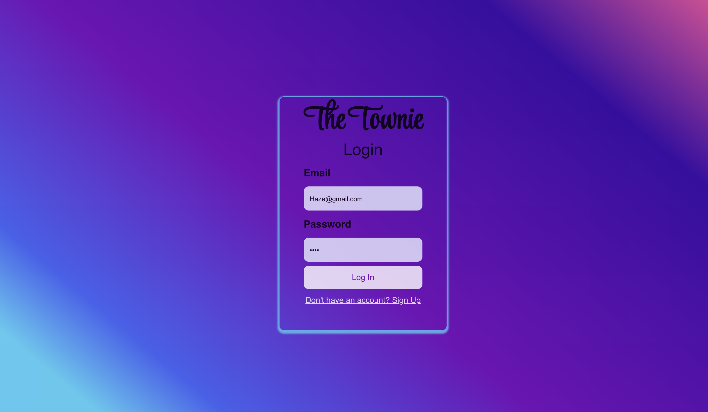
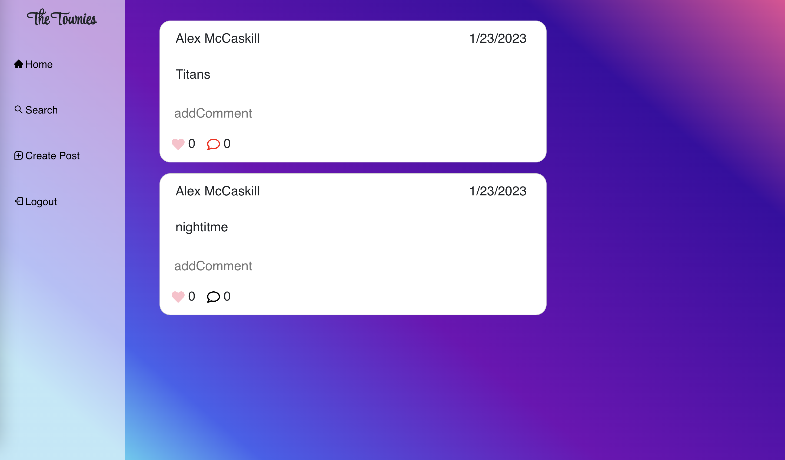
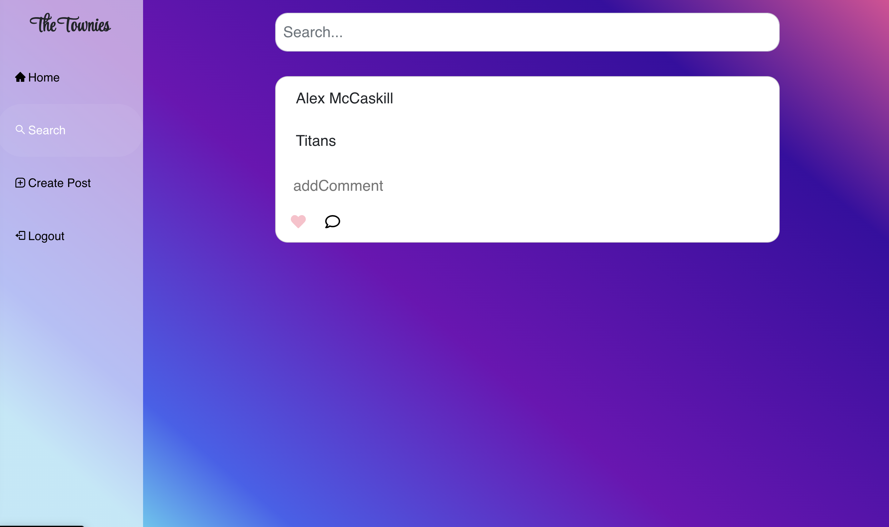
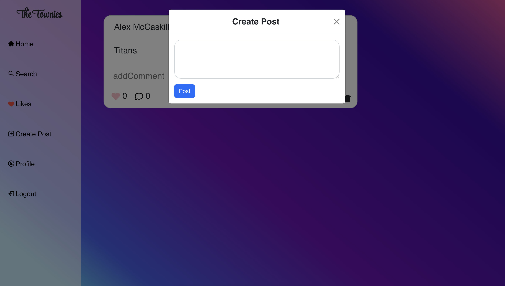

# The-Town-Soical
"Stay in the Loop"

## User Story 
As a user, I want a social media type application that allows me to post comments publicly and communicate with other users. 

## Description 
A place to share personal thoughts and words on a public network. You are able to post comments and save them to your feed, so that you can view later. Search Function allows you to search comments posted by users in the network and allows you to view all posts by that user. Every user has the ability to either like or comment on a post. Posts show date that the comment was posted. 

## Technolgies && Languages 
HTML, CSS, Javascript, Bootstrap, AOS, Express, Node.js, MySQL, Sequelize, Handlebars.js, Mongo DB, React, Appollo Client  

### Screenshots 

### Github Repo 
https://github.com/BryceBann/The-Town-Soical

###Contributors
BryceBann
TristanW63
Mccaskillk

### Deployed Application 
https://the-town-social.herokuapp.com/
